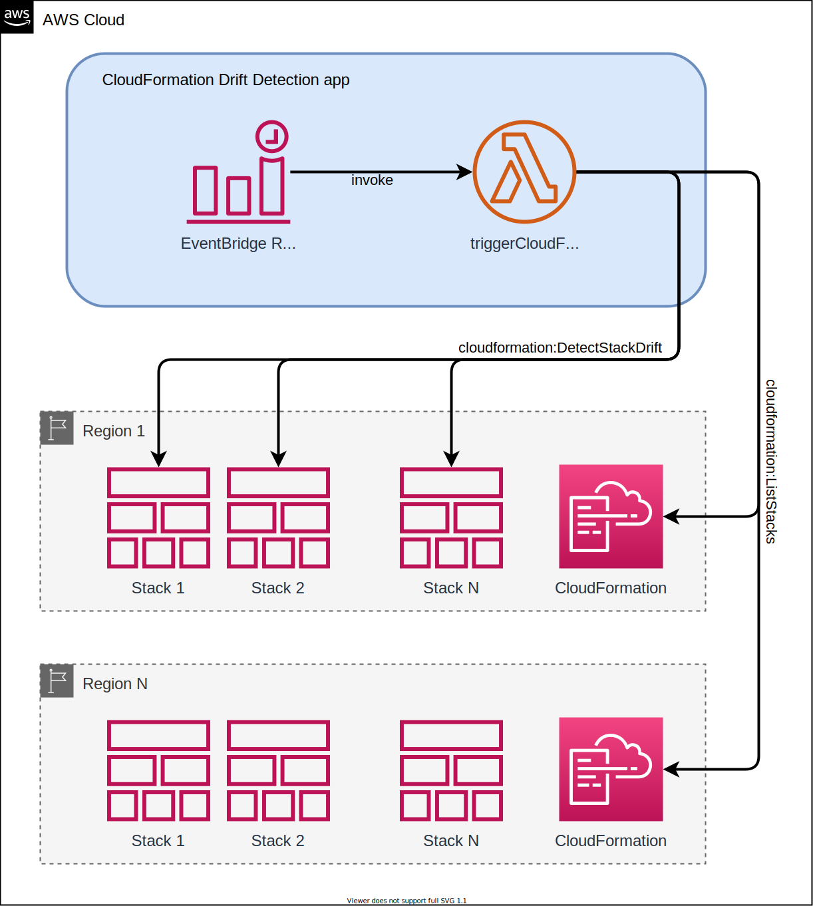

# CloudFormation drift detection

> [!WARNING]  
> This repository is no longer maintained.
>
> Check out AWS blog post: [Implementing an Alarm to Automatically Detect Drift in AWS CloudFormation Stacks](https://aws.amazon.com/blogs/mt/implementing-an-alarm-to-automatically-detect-drift-in-aws-cloudformation-stacks/) for a better way to achieve this using **AWS Config** and **Amazon EventBridge**.


- [CloudFormation drift detection](#cloudformation-drift-detection)
  - [Introduction](#introduction)
  - [Purpose](#purpose)
  - [How it works](#how-it-works)
    - [Configuration](#configuration)
      - [Regions](#regions)
      - [DriftDetectionMinAgeHours](#driftdetectionminagehours)
      - [ScanFrequencyHours](#scanfrequencyhours)
      - [DriftDetectionBatchSize](#driftdetectionbatchsize)
      - [ExcludedStackArns](#excludedstackarns)
    - [Architecture](#architecture)
  - [Deployment](#deployment)
    - [Deploy using Quick-create link](#deploy-using-quick-create-link)
    - [Deploy using AWS SAM](#deploy-using-aws-sam)
  - [Use the AWS SAM CLI to build and test locally](#use-the-aws-sam-cli-to-build-and-test-locally)
  - [Fetch, tail, and filter Lambda function logs](#fetch--tail--and-filter-lambda-function-logs)
  - [Cleanup](#cleanup)

## Introduction

This project contains an AWS Serverless Application Model (AWS SAM) application that regularly triggers drift detection on AWS CloudFormation Stacks.
It includes the following files and folders:

- `src` - Code for the application's Lambda function.
- `events` - Invocation events that you can use to invoke the function.
- `template.yml` - A template that defines the application's AWS resources.

Resources for this project are defined in the `template.yml` file.

## Purpose

Anyone who utilises AWS CloudFormation to manage their resources and wants to benefit from automatically
triggering CloudFormation drift detection may find this tool useful.

While every care has been taken to ensure the fitness of this tool for most AWS Accounts, we strongly recommend
users to review this tool and its configuration, and to test it thoroughly in a non-critical, non-production
environment before use.

Some environments may need gradual fine-tuning of configuration until the tool can adequately function. If you
have hundreds of CloudFormation stacks, we recommend starting with smaller batch sizes (no more than 20) and lower
frequencies (no more than every four hours) and increase it gradually over time.

## How it works

This application creates an EventBridge scheduled rule that triggers a Lambda function every few hours.
In each invocation, the Lambda function selects a batch of CloudFormation stacks that either do not have drift detection 
status, or the status is not up to date. These batches are selected in each configured region.

The Lambda function then triggers drift detection for each item in regional batches.

### Configuration

The following parameters will be presented to you during deployment of this application:

#### Regions

- Type: String
- Default: `all`

Comma-separated list of regions to scan for CloudFormation stacks, e.g. ap-southeast-2,us-west-2.
"all" means scan all available regions.

#### DriftDetectionMinAgeHours

- Type: Number
- Default: `24`
- MinValue: `24`
- MaxValue: `168`

The minimum age of a drift detection result in hours to be marked for drift detection. The system will trigger a new
drift detection after this time has passed from the previously completed drift detection. From 24 hours to
168 hours (1 week).

#### ScanFrequencyHours

- Type: Number
- Default: `1`
- MinValue: `1`
- MaxValue: `24`

The number of hours between scans. Each scan triggers as many drift detections in a region as DriftDetectionBatchSize.
From 1 hour to 24 hours.

#### DriftDetectionBatchSize

- Type: Number
- Default: `20`
- MinValue: `1`
- MaxValue: `200`

Maximum number of drift detections to be triggered per region by the system in every scan. Adjust this value in combination
with ScanFrequencyHours based on the number of Stacks you have.

#### ExcludedStackArns

- Type: String

Comma-separated list of CloudFormation Stack ARNs to be excluded by the system. Each item can be a regular expression
without the comma character, or a full CloudFormation Stack ARN.

### Architecture



## Deployment

### Deploy using Quick-create link

For your convenience, the latest prebuilt version of this application can be launched in your AWS account using the following
AWS CloudFormation quick-create link. Click the following button to start:

[](https://us-west-2.console.aws.amazon.com/cloudformation/home?region=us-west-2#/stacks/create/review?templateURL=https%3A%2F%2Fcloudconformity.s3-us-west-2.amazonaws.com%2Fcloudformation-drift-detection%2Ftemplate.yaml&stackName=cloudformation-drift-detection)

You can use [CloudFormation StackSets](https://docs.aws.amazon.com/cli/latest/reference/cloudformation/create-stack-set.html)
to deploy this application to multiple accounts. You can review [the CloudFormation template for this application](https://cloudconformity.s3-us-west-2.amazonaws.com/cloudformation-drift-detection/template.yaml) before using it.

### Deploy using AWS SAM

The AWS SAM CLI is an extension of the AWS CLI that adds functionality for building and testing Lambda applications. It uses Docker to run your functions in an Amazon Linux environment that matches Lambda. It can also emulate your application's build environment and API.

To use the AWS SAM CLI, you need the following tools:

- AWS SAM CLI - [Install the AWS SAM CLI](https://docs.aws.amazon.com/serverless-application-model/latest/developerguide/serverless-sam-cli-install.html).
- Node.js - [Install Node.js 14](https://nodejs.org/en/), including the npm package management tool.
- Docker - [Install Docker community edition](https://hub.docker.com/search/?type=edition&offering=community).

To build and deploy your application for the first time, run the following in your shell:

```bash
sam build
sam deploy --guided
```

The first command will build the source of your application. The second command will package and deploy your application to AWS, with a series of prompts:

- **Stack Name**: The name of the stack to deploy to CloudFormation. This should be unique to your account and region, and a good starting point would be something matching your project name.
- **AWS Region**: The AWS region you want to deploy your app to.
- **Confirm changes before deploy**: If set to yes, any change sets will be shown to you before execution for manual review. If set to no, the AWS SAM CLI will automatically deploy application changes.
- **Allow SAM CLI IAM role creation**: Many AWS SAM templates, including this example, create AWS IAM roles required for the AWS Lambda function(s) included to access AWS services. By default, these are scoped down to minimum required permissions. To deploy an AWS CloudFormation stack which creates or modifies IAM roles, the `CAPABILITY_IAM` value for `capabilities` must be provided. If permission isn't provided through this prompt, to deploy this example you must explicitly pass `--capabilities CAPABILITY_IAM` to the `sam deploy` command.
- **Save arguments to samconfig.toml**: If set to yes, your choices will be saved to a configuration file inside the project, so that in the future you can just re-run `sam deploy` without parameters to deploy changes to your application.

## Use the AWS SAM CLI to build and test locally

Build your application by using the `sam build` command.

```bash
tools-cloudformmation-drift-detection$ sam build
```

The AWS SAM CLI installs dependencies that are defined in `package.json`, creates a deployment package, and saves it in the `.aws-sam/build` folder.

Test a single function by invoking it directly with a test event. An event is a JSON document that represents the input that the function receives from the event source. Test events are included in the `events` folder in this project.

Run functions locally and invoke them with the `sam local invoke` command.

```bash
tools-cloudformmation-drift-detection$ sam local invoke TriggerCloudFormationDriftDetection --event events/event-cloudwatch-event.json
```

## Fetch, tail, and filter Lambda function logs

To simplify troubleshooting, the AWS SAM CLI has a command called `sam logs`. `sam logs` lets you fetch logs that are generated by your Lambda function from the command line. In addition to printing the logs on the terminal, this command has several nifty features to help you quickly find the bug.

**NOTE:** This command works for all Lambda functions, not just the ones you deploy using AWS SAM.

```bash
tools-cloudformmation-drift-detection$ sam logs -n TriggerCloudFormationDriftDetection --stack-name cloudformation-drift-detection-app --tail
```

**NOTE:** This uses the logical name of the function within the stack. This is the correct name to use when searching logs inside an AWS Lambda function within a CloudFormation stack, even if the deployed function name varies due to CloudFormation's unique resource name generation.

You can find more information and examples about filtering Lambda function logs in the [AWS SAM CLI documentation](https://docs.aws.amazon.com/serverless-application-model/latest/developerguide/serverless-sam-cli-logging.html).

## Cleanup

To delete the application that you created, use the AWS CLI. Assuming you used your project name for the stack name, you can run the following:

```bash
aws cloudformation delete-stack --stack-name cloudformation-drift-detection
```
